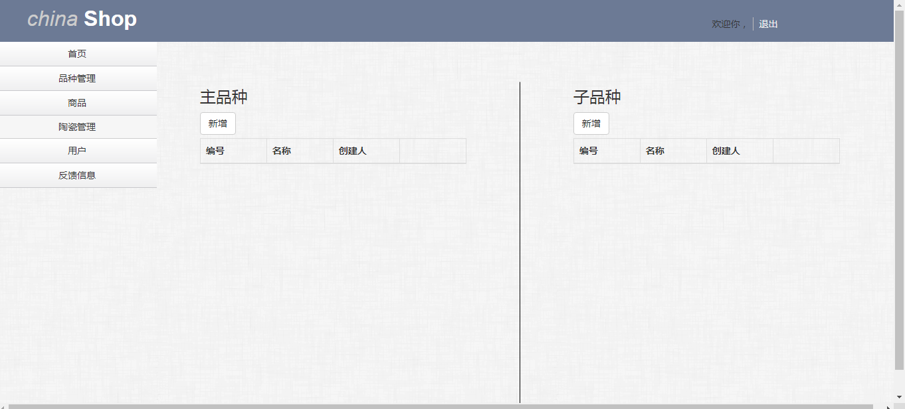
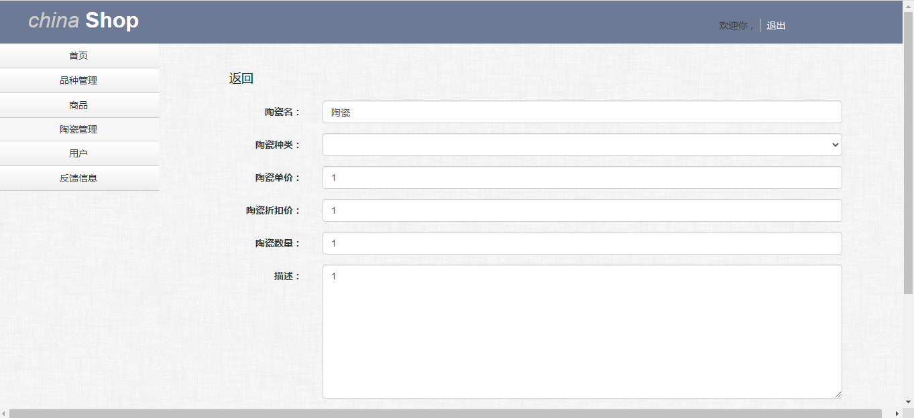
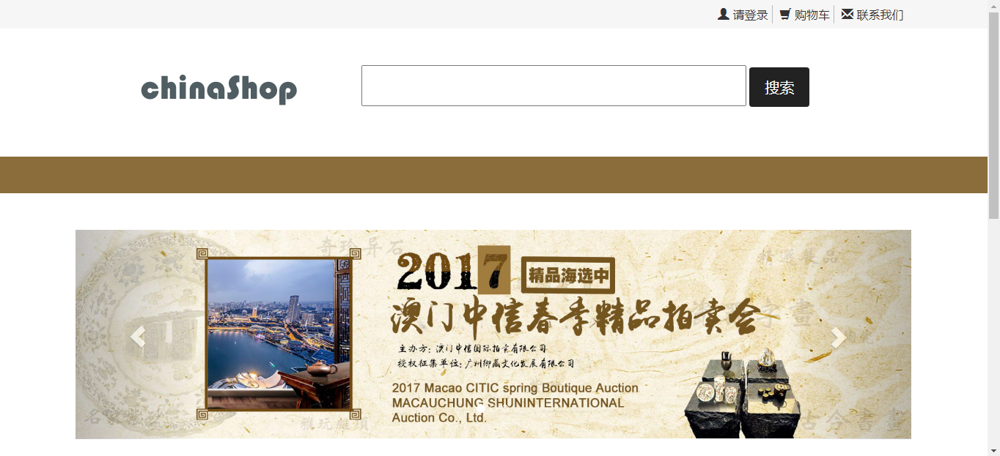
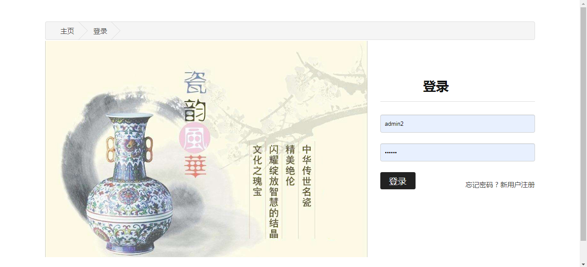
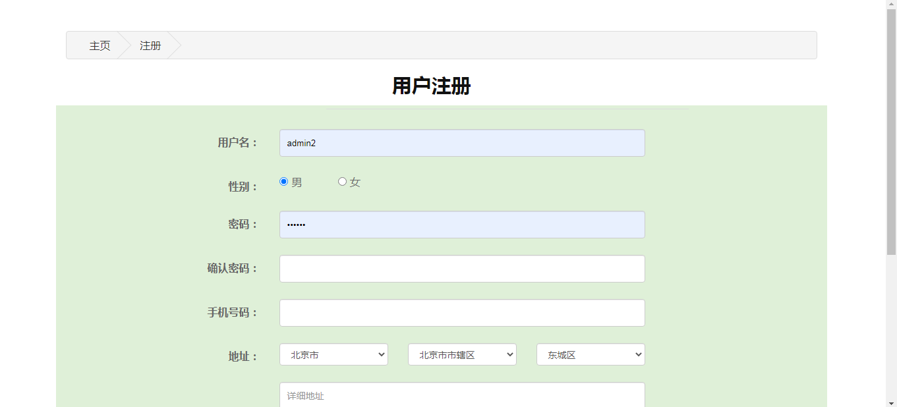
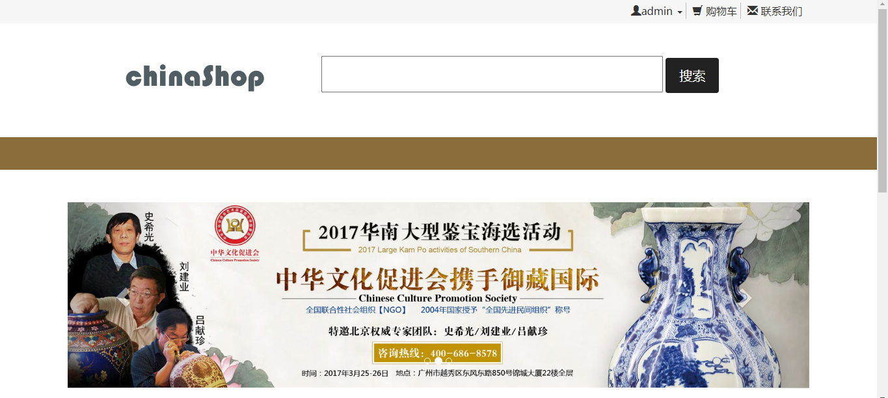

<h1 align="center">中国购物管理系统</h1>

## 简介
中国购物管理系统：角色分为管理员、用户；功能包括用户注册、商品与品种管理、陶瓷信息管理、用户登录与账户管理，提供宣传推广信息服务和活动信息展示。    --计算机毕业设计源码；毕设源码；java毕业设计源码

## 联系方式

<h3 align="center">获取完整代码与数据库文件 + 微信：bysj5151 QQ: 86050149 QQ群: 783742310</h3>

<h3 align="center">可帮忙远程部署 包运行成功！提供远程部署、修改代码、设计文档指导、代码讲解等服务！</h3>

## 功能介绍（完整见运行截图）
管理员：主要功能包括用户管理、品种管理、商品管理、陶瓷管理和反馈信息处理。可以通过系统界面添加或修改商品信息，尤其是陶瓷商品的详细管理，如名称、种类、单价和折扣价等。同时还有用户注册和登录功能的管理，如用户名和密码验证等。

用户：用户可以通过简单的注册界面进行账户创建，输入信息包括用户名、性别、密码确认等，可以选择地址和提供手机号码。登录页面通过组合输入用户名和密码，并有忘记密码功能。购物系统提供搜索商品、添加购物车、查看商品详细信息及参与活动广告的功能。

游客：系统主页展示中华传统工艺品的魅力，如传统花瓶图片等，通过导航栏可以访问主页和登录页面。游客可浏览商品信息及相关广告活动如精品海选活动，通过用户注册入口转化为系统注册用户，获取更多功能。

市场推广员：系统提供的广告与活动宣传页面有助于推广，如精品海选活动的呈现及宣传图为用户提供活动参与信息，增强购物体验，同时通过活动和广告的展示引导流量到网站，促进商品销售和用户注册。

## 运行截图

本代码来源于网络,仅供学习参考使用!

